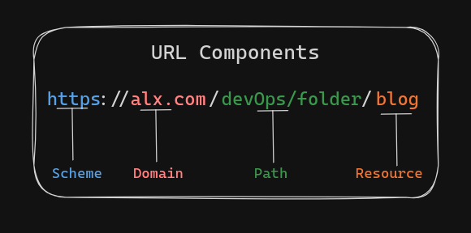
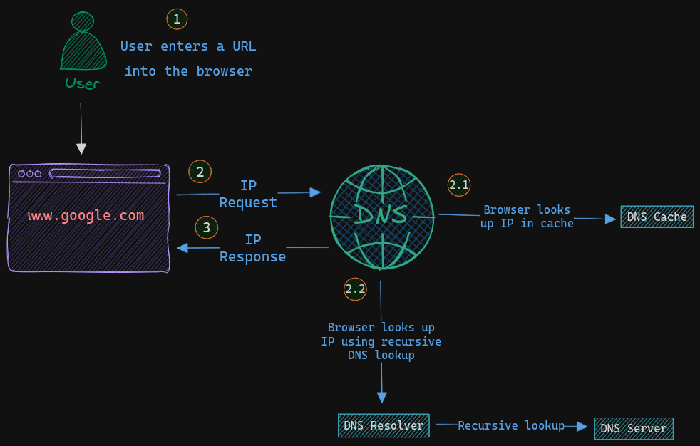
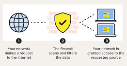
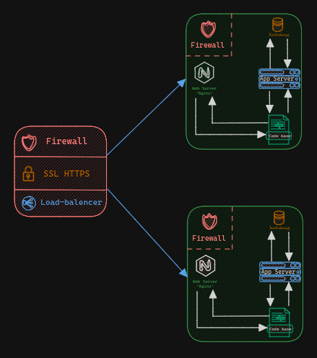
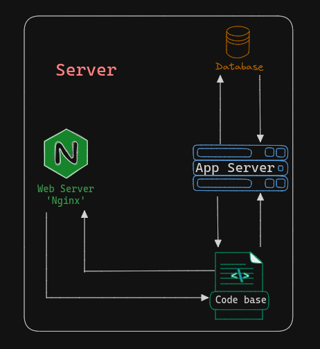
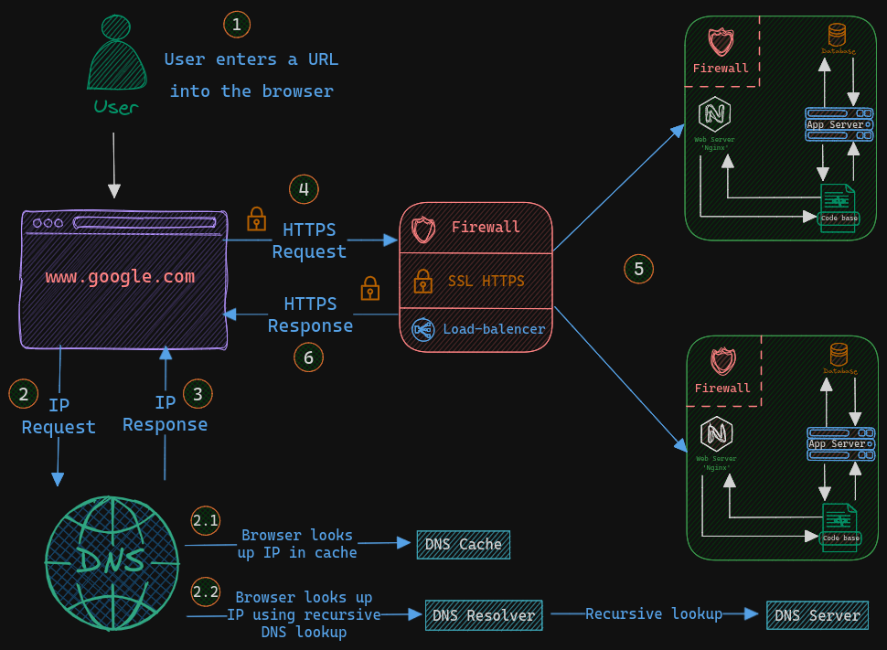

# What happens when you type `google.com` in your browser and press Enter: From URL to Web Page

Blog Link: [Medium](https://medium.com/@dawoud27/understanding-the-journey-of-a-web-request-from-url-to-web-page-fba784c9e4bf) || [LinkedIn](https://www.linkedin.com/pulse/what-happens-when-you-type-googlecom-your-browser-press-dawoud-ks19f)

Embarking on a journey through the intricate layers of web browsing reveals the fascinating interplay of technologies that seamlessly deliver content to our screens.

From the inception of a simple URL to the final rendering of a web page, numerous components work in harmony to provide users with a rich online experience. Let's delve deeper into each step of this captivating journey, but first let's understand the URL structure *take a look of the following picture:* 

 

## DNS Request: The Gateway to the Internet
Our journey commences with a Domain Name System (**DNS**) request. When we type a URL like https://www.google.com into our browser.

- Initiating with a **Domain Name System (DNS)** request, the browser seeks to translate the user-input URL into an *IP address*, enabling communication with the intended server.

- It sends a DNS query to a DNS resolver, which then recursively queries various DNS servers until it obtains the *IP address* associated with the domain name.

## TCP/IP: Establishing Connections
*The Transmission **Control Protocol/Internet Protocol (TCP/IP)** is a suite of communication protocols used to connect devices on a network. It is the basis for the Internet and most other modern networks.*

- Establishing a Transmission Control Protocol (TCP) connection via Internet Protocol (IP) ensures reliable data transmission by segmenting information into **packets**, ready for transmission across the network.

- TCP/IP forms the backbone of internet communication, facilitating seamless connectivity between clients and servers.

## Firewall: Safeguarding the Gateway

*Before our packets can reach their destination, they may encounter firewalls.*

- **Firewalls** act as vigilant gatekeepers, filtering incoming and outgoing traffic to safeguard networks from unauthorized access and potential threats.

- Through predefined rules and policies, firewalls regulate traffic flow, ensuring secure and controlled communication channels.

<!-- Reference https://us.norton.com/blog/privacy/firewall -->

## HTTPS/SSL: Ensuring Secure Communication

*In our quest for secure browsing, HTTPS steps onto the stage.*

- The adoption of **Hypertext Transfer Protocol Secure (HTTPS)** with Secure Sockets Layer *(SSL)* or Transport Layer Security *(TLS)* encryption safeguards data transmission between the browser and the server.

- **HTTPS** enhances security and privacy, preventing eavesdropping and unauthorized access to sensitive information exchanged during browsing sessions.

<!-- Reference https://medium.com/@kasunpdh/ssl-handshake-explained-4dabb87cdce -->

## Load Balancer: Distributing the Load

*A load balancer is a device that distributes incoming network traffic across multiple servers.*

- Behind the scenes, large-scale websites like Google often employ load balancers to distribute incoming traffic across multiple servers.

- Load balancers help optimize resource utilization, improve scalability, and enhance fault tolerance by evenly distributing the workload among various servers.

## Web Server: Serving up the Content

*Once our request reaches its destination, it encounters the web server hosting the requested web page.*

- The web server processes our request, retrieves the relevant resources such as HTML, CSS, and JavaScript files, and constructs a response to send back to our browser.

- Through HTTP or HTTPS protocols, web servers fulfill user requests, retrieving and transmitting relevant data for rendering in the browser.

## Application Server: Executing Dynamic Content

*In some cases, the web server may need assistance from an application server to fulfill our request.*

- Application servers execute server-side scripts and handle dynamic content generation, interfacing with databases and external services to process user requests.

- By executing server-side logic, application servers facilitate dynamic web experiences, enabling personalized content delivery and interactive functionalities.

## Database: Where Data Resides

*Behind many web applications lies a database where crucial data is stored and retrieved.*

- Databases store structured data used by web applications, providing persistent storage for user information, content, and system configurations.

- Application servers interact with databases to retrieve, manipulate, and update data, ensuring seamless integration between frontend interfaces and backend data sources.

## Conclusion: Navigating the Digital Landscape

In conclusion, navigating the complexities of web browsing unveils a sophisticated ecosystem of interconnected technologies.

From the initial *DNS* resolution to the dynamic content delivery facilitated by *application servers* and *databases*, each component plays a crucial role in orchestrating the seamless flow of information across the internet.

Understanding these intricacies not only enhances our appreciation for the digital landscape but also empowers us to navigate it with confidence and insight.

*So, the next time you enter a URL into your browser, marvel at the intricate journey it embarks on to bring the web to your fingertips.*

